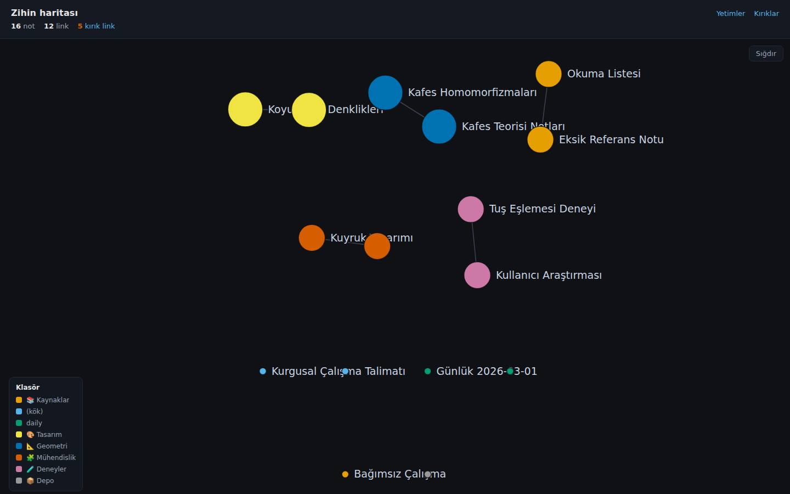
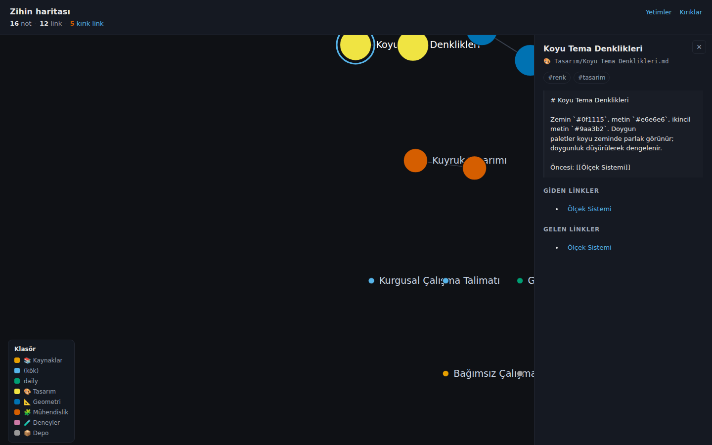
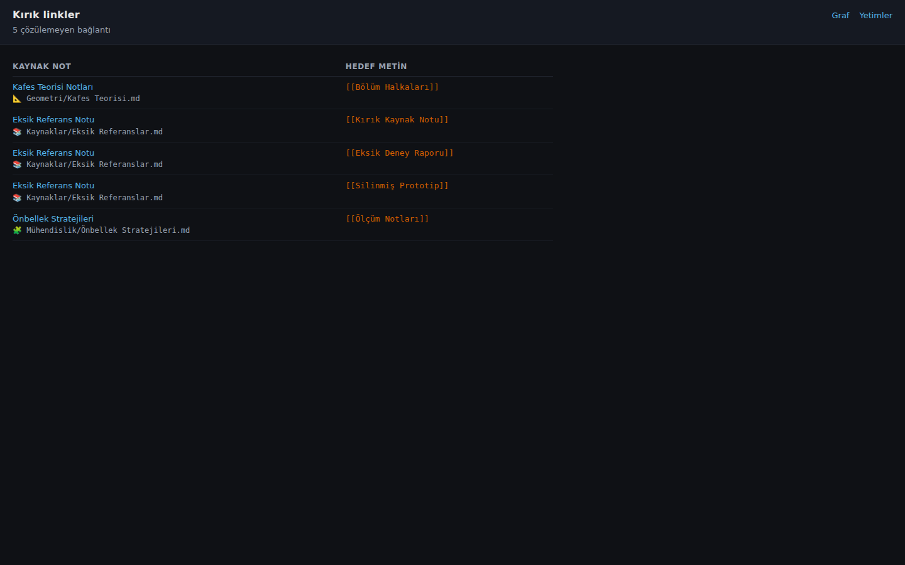
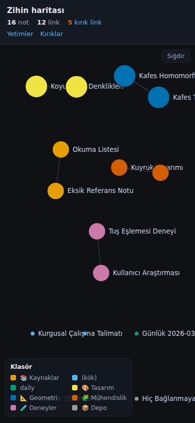

# harita

Markdown vault'unu okuyup **not grafiğini** web'de gösteren salt-okunur araç.

- **Dalga A** — ayrıştırıcı + SQLite indeks + CLI (yalnızca Python stdlib).
- **Dalga B** — Flask tabanlı web graf (tek bağımlılık: `flask`).

Obsidian'ın grafı `search` filtresi yüzünden düğümleri gizlemişti; `harita`
hiçbir filtre uygulamaz — vault'taki tüm notlar ve bağlantılar görünür.

## Ne yapar

- Vault'u tarar (`*.md`), **hiçbir dosyayı değiştirmez** — yalnızca okur.
- Her notu ayrıştırır: `title`/`aliases`/`tags` frontmatter'ı, `#etiket`ler,
  `[[wikilink]]`ler (`[[not#başlık|görünen]]` ve `![[gömülü]]` dâhil).
- Linkleri Obsidian mantığıyla çözer: dosya adı → frontmatter `title` → takma ad.
  Çözülemeyenler **kırık link** olur.
- Gövdeyi ~800 karakterlik parçalara böler (arama için hazır; Dalga C).

## Kurulum

```bash
python3 -m pip install -r requirements.txt       # flask
python3 -m pip install -r requirements-dev.txt   # + pytest, playwright
```

## Kullanım

```bash
# indeksle (ilk seferde)
harita indeksle /path/to/vault

# raporlar
harita kirik             # çözülemeyen linkler: kaynak → hedef
harita yetim             # GERÇEK yetimler (aşağıya bak)
harita yetim --tumu      # daily/ günlükleri ve kök dosyaları da dahil
harita etiketler --ilk 10 # en sık etiketler

# web grafı — DAİMA 127.0.0.1'de
harita web /path/to/vault            # önce indeksler, sonra sunar
harita web --db /tmp/harita.db       # hazır indeksi sun
harita web /path/to/vault --port 8900
```

Veritabanı yolunu `--db` ile ya da `HARITA_DB` ortam değişkeniyle belirle.
Varsayılan `~/.harita/harita.db`. **Veritabanı vault'un içine yazılmaz.**

### Yetim notlar: iki sınıf

Dalga A tek bir "yetim" listesi veriyordu; içinde `daily/` günlükleri ve
`README.md` gibi **yapıları gereği tek başına duran** dosyalar da vardı.
Dalga B bunları ikiye ayırır:

| Sınıf | Kural | Örnek |
|---|---|---|
| **Gerçek yetim** | Ne link alan ne link veren not | `📐 Geometri/Kafes Teorisi.md` |
| **Yok sayılabilir** | `daily/` ile başlayan yol (`daily/v3/` dâhil) ya da **kökteki tek-bileşenli her `.md` dosyası** | `daily/2026-03-01.md`, `README.md`, `beyin.py` |

`harita yetim` varsayılan olarak **yalnız gerçek yetimleri** listeler;
`--tumu` Dalga A davranışını verir. Web'de `/yetim` her iki sınıfı ayrı
bölümlerde gösterir.

Kök dosya kuralı yapısal olduğu için isim listesi yoktur: kökteki `README.md`
olduğu kadar `1.md` ya da `AUDIT_REPORT.md` de "yapıları gereği tek başına
durur". Kökteki **alt klasör** (`klasor/not.md`) yalnız kalıyorsa gerçek
yetimdir.

## Web arayüzü

`harita web` grafı `http://127.0.0.1:8765` adresinde açar.

| Rota | İçerik |
|---|---|
| `/` | Tam ekran SVG graf + sağda kapanabilir panel + üstte özet şeridi |
| `/kirik` | Kırık link tablosu (her satır grafta o kaynak notu açar) |
| `/yetim` | Gerçek yetim / yok sayılabilir — iki bölüm |
| `/api/graf` | `{"dugumler":[…],"kenarlar":[…]}` (yalnız **çözülmüş** linkler) |
| `/api/not/<id>` | Başlık, yol, etiketler, ~600 karakterlik özet, `ozet_kesildi`, giden/gelen linkler, kırıklar |
| `/saglik` | `{"durum":"ok"}` |

Yalnızca `GET` kabul edilir; `POST`/`PUT`/`DELETE` → **405**.

### Graf davranışı

- **Renk** = notun en üst klasörü. Renk körü-güvenli 8 renklik **Okabe-Ito**
  paleti; 8'den fazla klasör varsa kalanlar gri ve lejanta `"diğer (N)"` girer.
- **Boyut** = derece (bağlantı sayısı), kökten yuvarlanarak.
- **Etiketler** koyu zeminde **sabit ≥11 px** (yakınlaştırma ölçeğinden bağımsız;
  ölçek `punto / ölçek` ile telafi edilir). Derece sırasıyla yerleştirilir ve
  kutuları kesişen etiket gizlenir; yakınlaştıkça daha fazlası görünür. Seçili
  düğümün etiketi her zaman görünür.
- **Etkileşim**: düğümü sürükle, tekerlekle/pinch ile yakınlaştır, tıkla → panel.
  Paneldeki giden/gelen bağlantılar ilgili düğüme odaklar. `Esc` kapatır.
- **Klavye**: düğümler `tabindex="0"`; `Tab` ile gezinilir, `Enter` açar.
- **Yerleşim**: sabit tur sayılı kuvvet-yönlendirmeli algoritma. Bağlantı çekimi
  **yay** tipindedir (kuvvet ∝ `d − L`, L = 70); itme Coulomb tipidir ve ızgara
  hücrelerinden toplu hesaplanır (≈O(n)). Turlar `requestAnimationFrame` ile
  parça parça çalışır, sayfa donmaz.
- **Başlangıç konumları deterministiktir**: not id'sinden türetilen tohumlu
  sözde-rastgele kullanılır, bu yüzden aynı vault her açılışta **aynı** görüntüyü
  verir (ekran görüntüleri tekrarlanabilir).
- **Bileşen paketleme**: yerleşim bittiğinde her bağlı bileşen katı bir cisim
  gibi taşınır ve saran çemberleri komşusuna değecek kadar ayrılır — iki küme
  üst üste binmez. Bağlantısız **tek** düğümler (yetimler) grafın ortasında
  dağınık kalmaz, ana bloğun altında düzenli sıralara dizilir.
- **Sığdırma**: yerleşim bittiğinde ve pencere yeniden boyutlanınca düğüm sınır
  kutusu görünür sahneye 40 px boşlukla sığdırılır (ölçek 0.25–3 arasında
  kelepçeli; panel açıkken panelin kapladığı alan hariç). Kendi kaydırma ve
  yakınlaştırman **sonrası otomatik sığdırma tekrarlanmaz** — bunun için
  sağ üstte klavyeyle erişilebilir bir **Sığdır** düğmesi vardır.

### Mobil

360–390 px genişlikte düzen kırılmaz: üst şerit iki satıra iner, lejant iki
sütuna bölünür, yan panel **altta** açılır. Yatay kaydırma çubuğu oluşmaz.

## Ekran görüntüleri

Aşağıdakiler **tamamen kurgusal** bir demo vault'tan üretildi
(`python3 scripts/ekran_goruntusu.py`). Gerçek vault'tan hiçbir not başlığı,
yol veya özet görüntülerde yoktur.



*Sol üstte özet şeridi (not / link / kırık), sağ altta klasör lejantı, sağ üstte
"Sığdır" düğmesi. Bağlı notlar kümeler hâlinde yan yana; bağlantısız notlar
altta düzenli sıralarda.*



*Düğüme tıklandığında sağdan açılan panel: başlık ve yol üst şeridin altında,
etiketler, özet ve koyu temaya uygun tıklanabilir giden/gelen bağlantılar.*



*`/kirik` — çözülemeyen bağlantılar; her satır graf içinde kaynak notu açar.*



*390 × 844 — graf ekranı doldurur, etiketler okunur; panel altta açılır,
yatay kaydırma çubuğu yoktur.*

## Güvenlik ve gizlilik

Bağlayıcı kurallar; hepsi testlerle kanıtlanır.

- **Yalnız `127.0.0.1`.** Sunucu adresi kodda sabittir, `--host` seçeneği
  **yoktur**. `0.0.0.0` dinlenmez (test: gerçek süreç + kaynak taraması).
- **DNS rebinding koruması.** `Host` başlığı `127.0.0.1[:p]` veya
  `localhost[:p]` değilse **403**; reddedilen istek indeksi hiç açmaz.
- **Salt-okunur indeks.** Web, DB'yi `mode=ro` ile açar; yazma denemesi
  `sqlite3.OperationalError` verir. Vault'a **hiçbir yazma yolu yoktur** —
  tüm GET rotaları sonrası dosya hash'leri değişmez.
- **XSS.** Not başlıkları ve yollar kullanıcı içeriğidir. HTML rotalarında Jinja
  autoescape açık; graf JS'i DOM'a yalnız `textContent`/`setAttribute` yazar
  (`innerHTML` hiç yok). Testler `<script>window.__xss=1</script>` ve
  `">` yükleriyle hem HTML'i hem de tarayıcıdaki
  `window.__xss`/`window.__xss2` değerlerini sınar.
- **CSP.** `default-src 'none'; script-src 'self'; style-src 'self';
  img-src 'self' data:; connect-src 'self'; base-uri 'none';
  form-action 'none'; frame-ancestors 'none'` — satır içi script/stil yok,
  JS ve CSS `static/` dosyasından gelir. Ayrıca `X-Content-Type-Options`,
  `Referrer-Policy: no-referrer` ve `Cache-Control: no-store`.
- **Yol yüzeyi yok.** Rotalar yalnızca sayısal id kabul eder; hiçbir rota
  dosya sistemi yolu almaz.
- **Sır süzme.** `sk-…`, `password=`, `api_key=…`,
  `-----BEGIN … PRIVATE KEY-----` içeren satırlar gövdeden ve `chunks`'tan
  **çıkarılır**; panel özeti yalnız `chunks`'tan okunur, ham dosya ASLA
  yeniden açılmaz.
- **İçerik dışarı gitmez.** Ağ trafiği yalnız `127.0.0.1`'dedir; CDN, uzak
  font, analitik yoktur.

## Testler

```bash
python3 -m pytest -q                     # tamamı (birim + e2e + performans)
python3 -m pytest -q -m "not e2e"        # yalnız hızlı birim testleri
```

- Testler yalnızca `tmp_path` içinde **kurgusal** notlar yazar; gerçek vault
  içeriği testlere hiç girmez (bir test bunu ayrıca doğrular).
- Playwright e2e testleri gerçek `harita web` **sürecini** ayağa kaldırır.
  Playwright ya da Chromium yoksa **atlanır** ve skip nedeni yazılır.
- Performans testi çalışma zamanında üretilen **1200 notluk** sentetik vault'u
  indeksler ve ilk çizim süresini ölçer (kabul: < 3 sn).

## Dalga durumu

Dalga A (ayrıştırıcı + indeks + CLI) ve Dalga B (web graf) tamam.
Dalga B.1 (görsel kusur düzeltmeleri: sığdırma, bileşen paketleme, etiket
okunurluğu, panel konumu) tamam.
Dalga C (anlamsal arama) ve Dalga D (haftalık özet) henüz yok.